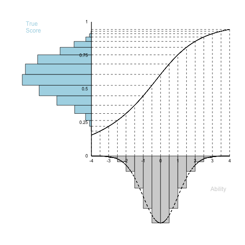
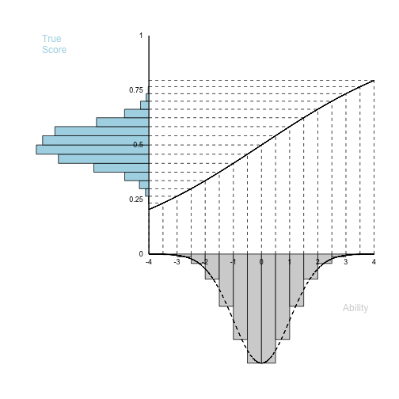
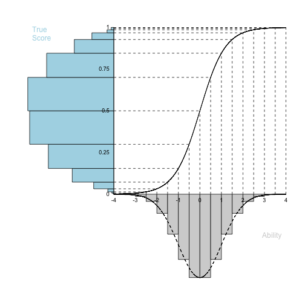
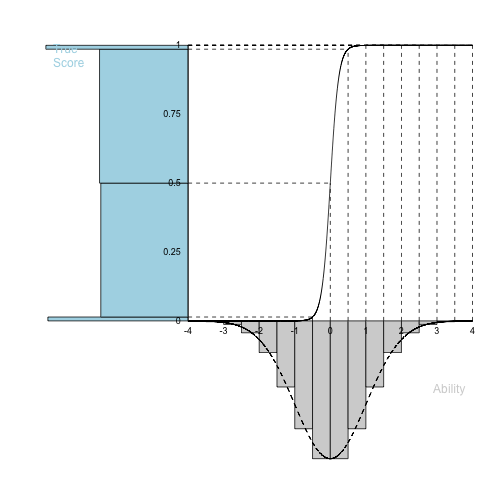
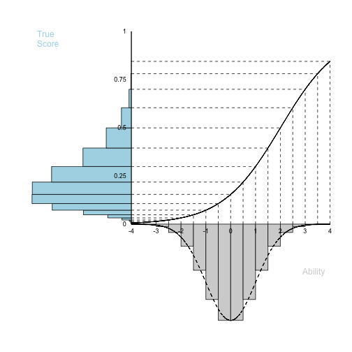
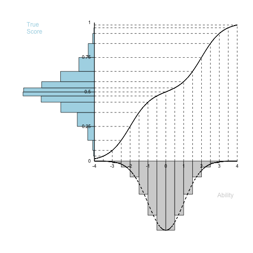
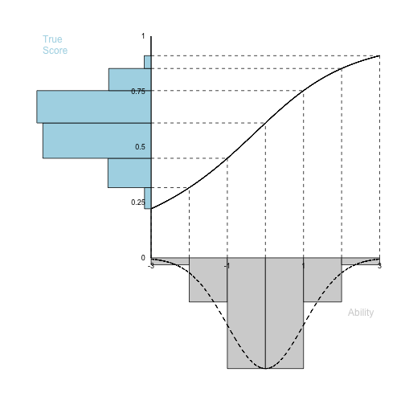
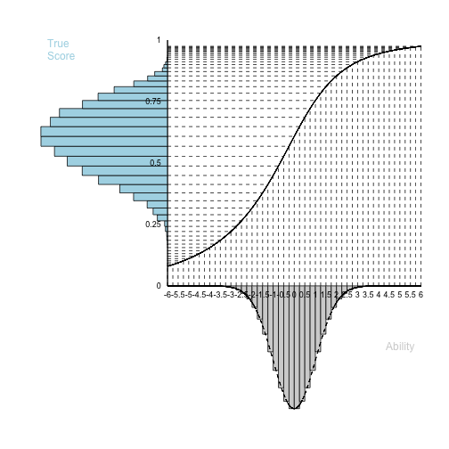
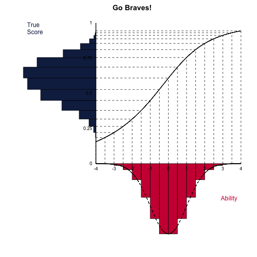
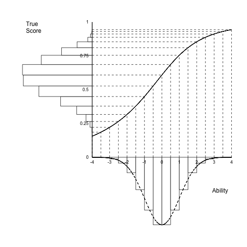

This function was created in response to a contest offered by Rich Jones at the 2016 Latent Variable Methods Workshop.

This is a development package available for installation through github.

```r
library(devtools)
install_github("begavett/lordplot")
```

Here's an example of how to use this function at its most simple.

The defaults are a 3-item test with:

  - discrimination (a) parameters of .2, .4, and .6
  - difficulty (b) parameters of -2, -1, and 0
  - a guessing (c) parameter fixed to 0 for all items
  - D of 1.7


```r
lordplot()
```



Below, the lordplot function will attempt to recreate some of Lord's original figures. 

## Fig 9. Derivation of the Distribution of True Scores for a Test of Moderate Difficulty and Poor Discriminating Power

[*the function will use values of b = 0 for "moderate difficulty" and a = .2 as "poor discriminating power"*]


```r
lordplot(b = 0, a = .2)
```



## Fig 10. Derivation of the Distribution of True Scores for a Test of Moderate Difficulty and Very High Discriminating Power

[*the function will use values of b = 0 for "moderate difficulty" and a = 1 as "very high discriminating power"*]


```r
lordplot(b = 0, a = 1)
```



## Fig 11. Derivation of the Distribution of True Scores for a Test of Moderate Difficulty and Extremely High Discriminating Power

[*the function will use values of b = 0 for "moderate difficulty" and a = 5 as "extremely high discriminating power"*]


```r
lordplot(b = 0, a = 5)
```



## Fig 12. Derivation of the Distribution of True Scores for a Difficult Test of Average Discriminating Power

[*the function will use values of b = 2 for "difficult" and a = .5 as "average discriminating power"*]


```r
lordplot(b = 2, a = .5)
```



## Fig 14. Derivation of the Distribution of True Scores for a Test Composed Half of Easy Items and Half of Difficult Items.

Both items are highly discriminating (a = 1)

[*the function will use values of b = -2 and +2 for "easy" and "difficult," respectively, with a = 1 for both items*]


```r
lordplot(b = c(-2, 2), a = c(1, 1))
```



## You can also change the x-axis


```r
lordplot(xlim = c(-3, 3), xby = 1)
```




```r
lordplot(xlim = c(-6, 6), xby = .25)
```



## And the colors


```r
lordplot(xcol = "#CE1141", ycol = "#13274F", main = "Go Braves!")
```




```r
lordplot(xcol = "white", ycol = "white", xlabcol = "black", ylabcol = "black")
```


